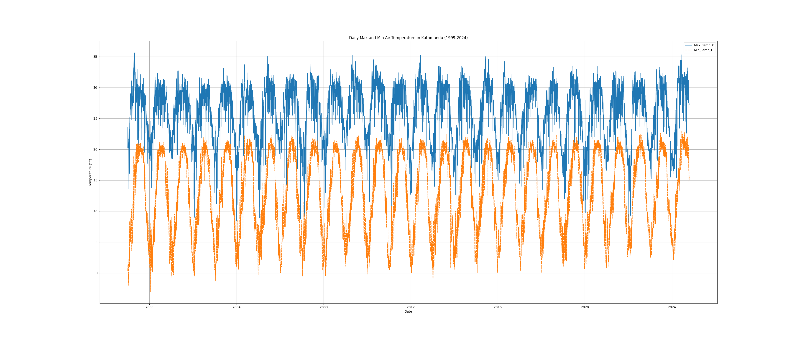
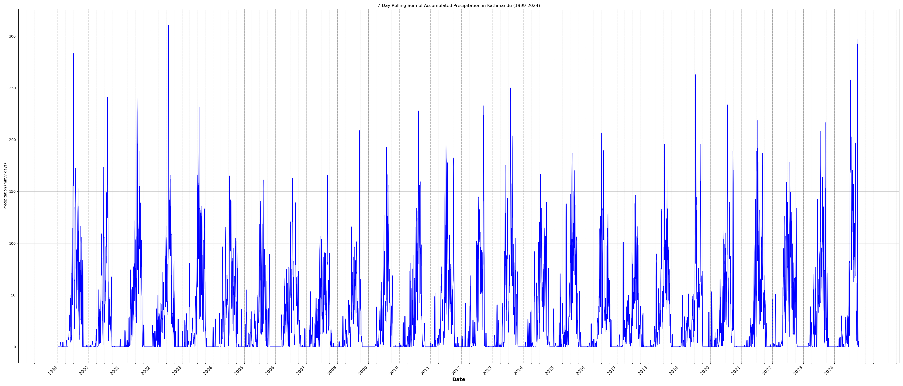
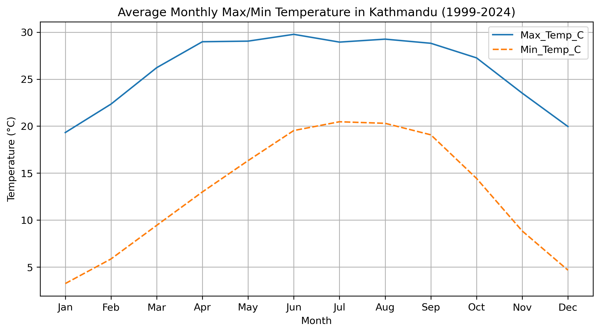
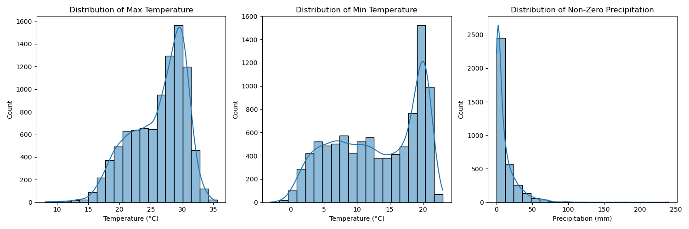
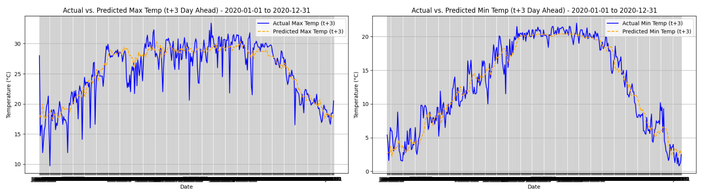
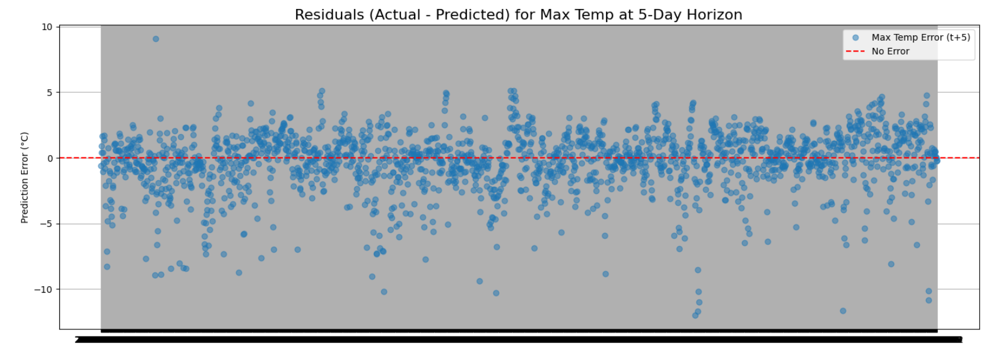

# Kathmandu Climate Insights: A Multi-Horizon Temperature Forecasting Project

This repository documents the end-to-end development of a machine learning model to forecast daily maximum and minimum temperatures for Kathmandu, Nepal, across a 1- to 5-day horizon.

**Project Status (as of July 2025):** Phase 1 Complete. A baseline model has been established and analyzed. Phase 2 (integration of external climate variables) is underway.

---

### Project Goal

The primary objective is to apply ML practices to build an accurate and reliable multi-horizon temperature forecasting model. This project serves as a practical demonstration of time-series analysis, feature engineering, and model evaluation techniques in a real-world climate science context.

---

### Key Findings & TL;DR

*   **Successful Baseline:** A tuned XGBoost model was successfully built, outperforming a Linear Regression baseline on 8 out of 10 forecasting tasks.
*   **Performance vs. Horizon:** The model's advantage is most significant on longer horizons (`t+3` to `t+5`), where it better captures non-linear trends. For the `t+5` forecast, it reduced the Mean Absolute Error (MAE) by **0.10°C** compared to the baseline.
*   **Insight from Error Analysis:** Visual analysis revealed the model excels at predicting long-term seasonal trends (**climatology**) but struggles with sharp, day-to-day volatility (**weather**). This is the key limitation to address.
*   **Data-Driven Next Steps:** The error analysis points directly to the need for more descriptive features. The next phase will focus on integrating **Relative Humidity (RH)** and **Wind Speed/Direction** data to better model the drivers of abrupt weather changes.

---

### Methodology & Workflow

#### 1. Data Ingestion & Cleaning
*   **Source:** 25+ years of historical daily temperature and precipitation data for Kathmandu.
*   **Process:** Handled multi-line headers, consolidated twice-daily readings into single daily records, and performed data type conversions. Isolated missing values were handled using interpolation for temperature and fill-with-zero for precipitation.
*   **Data Source:** The climate data used in this project was provided by the Department of Hydrology and Meteorology (DHM), Government of Nepal.

#### 2. Exploratory Data Analysis (EDA)
EDA was critical for understanding the underlying patterns in the data.

| Daily max/min temperature profile (1999-2024) | 
| :--------------------: |
|  | 

##### Daily Max and Min Air Temperature in Kathmandu (1999-2024)
This time-series plot reveals Kathmandu's daily temperature dynamics over 25 years.
- Dominant Annual Seasonality: 
Displays a very strong and consistent yearly cycle for both maximum (blue line) and minimum (orange dashed line) temperatures, reflecting clear summer and winter periods.
- Consistent Daily Fluctuation: 
The distinct gap between the maximum and minimum temperature lines throughout the year illustrates the daily diurnal range, showing how temperature fluctuates within a single 24-hour period.
- Inter-annual Variability: 
While the overall seasonal pattern is stable, there's noticeable year-to-year variability in the amplitude of temperature swings and specific daily values, indicating natural weather variations.
- Long-term Trend (Visual): 
Visually, a prominent, consistent linear warming or cooling trend is not immediately evident across the entire period, suggesting a relatively stable overall climate pattern within this dataset's timeframe. However, fluctuations exist year to year.
###### Observed Extremes:
- Winter Cold: 
Minimum temperatures frequently drop close to 0°C during the coldest winter months (typically Dec-Feb).
- Summer Heat: 
Maximum temperatures consistently reach into the low 30s °C during the warmest summer months (typically Jun-Aug).

7-day rolling sum of Precipitation (1999-2024) |
| :------------------------------: |
| |

##### 7-Day Rolling Sum of Accumulated Precipitation in Kathmandu (1999-2024)
- Dominant Monsoon Seasonality: Shows a very strong and consistent annual cycle characterized by distinct wet and dry periods. The monsoon season is clearly visible with significant precipitation, primarily occurring from approximately June to September.
- Pronounced Dry Season: Outside the monsoon, precipitation is consistently low or non-existent, indicating a prolonged dry season, particularly from October through May.
- Variable Monsoon Intensity: The height and duration of the blue peaks vary considerably year-to-year. Some years exhibit higher and more sustained rainfall (e.g., 2000, 2002, 2010, 2020, 2024 (partial)), while others appear to have comparatively drier monsoons or shorter intense periods (e.g., 2004, 2007, 2008, 2014, 2017).
- Extreme Events: The sharp, tall spikes within the monsoon periods represent significant, concentrated rainfall events. These visually indicate instances of heavy downpours or extended wet spells, which are crucial for flood risk assessment and water resource management.
- No Obvious Long-Term Trend: Across the 25-year span, there isn't an immediately apparent linear increase or decrease in overall monsoon intensity or duration, though inter-annual variability is high.

| Average Monthly Temperature Cycle |
| :--------------------: |
|  | 

##### Average Monthly Max/Min Temperature in Kathmandu (1999-2024)
This plot clearly illustrates Kathmandu's distinct annual temperature cycle, reflecting its subtropical highland climate.
- Prominent Annual Cycle: 
Temperatures follow a strong, predictable seasonal pattern, reflecting the Northern Hemisphere's winter and summer.
- Coldest Period: 
January and February are the coldest months (Min Avg: ~3-5°C; Max Avg: ~18-21°C), aligning with the peak winter season.
- Warmest Period: 
Temperatures steadily rise from March, peaking in June-July (Max Avg: ~29-30°C; Min Avg: ~20°C), corresponding to the pre-monsoon and early monsoon warmth.
###### Diurnal Temperature Range (DTR) - Seasonal Variation:
- Wider DTR (Dry Season - Oct-May): 
The larger gap between Max and Min temperatures, particularly prominent in spring (Mar-Apr) and post-monsoon (Oct-Nov), indicates clearer skies and lower humidity. This allows for greater radiative cooling at night (cooler lows) and more intense solar heating during the day (warmer highs).
- Narrower DTR (Monsoon Season - Jun-Sep): 
The compressed temperature range during these months is a hallmark of monsoon influence. Increased cloud cover and high humidity dampen both daytime heating and nighttime cooling, resulting in consistently warmer nights and relatively subdued daytime highs.
- Climate Alignment: 
These observations are characteristic of a monsoon climate, where atmospheric moisture and cloud cover significantly regulate diurnal temperature swings.

 Data Distributions |
| :------------------------------: |
| |

##### Distribution of Max Temperature, Min Temperature, and Non-Zero Precipitation
These histograms, with their Kernel Density Estimates (KDEs), reveal the frequency and spread of temperature and precipitation values in Kathmandu.
###### Distribution of Max Temperature:
- The distribution is largely unimodal (single peak) and somewhat bell-shaped, centered around 28-30°C.
- This indicates that maximum temperatures in Kathmandu most frequently fall within a comfortable warm range, representing the prevalent conditions during most of the year outside of peak winter.
###### Distribution of Min Temperature:
- This plot reveals a bimodal (two-peak) distribution, which is highly insightful.
- One distinct peak occurs around 3-5°C, representing the cold minimum temperatures experienced during the winter months.
- A broader, less defined peak or plateau is visible around 18-20°C, reflecting the warmer minimum temperatures during the monsoon and post-monsoon seasons.
- This bimodality strongly indicates two distinct thermal regimes for nighttime temperatures in Kathmandu, primarily driven by seasonal atmospheric conditions (clear winter nights allowing strong radiative cooling vs. humid, cloudy monsoon nights trapping heat).
###### Distribution of Non-Zero Precipitation:
- The distribution is highly right-skewed (positively skewed), with a large concentration of data points near 0 mm.
- This confirms that while precipitation events are frequent, the vast majority are small in magnitude (e.g., 0-25 mm).
- The long tail extending to higher values indicates that very heavy rainfall events (e.g., >100 mm) occur but are comparatively rare, yet crucial for flood assessment.
- This extreme skewness implies that standard statistical models might benefit from data transformations (like a log transform) when working with precipitation, to better approximate a normal distribution.

#### 3. Feature Engineering
A rich feature set was created to capture the temporal dynamics of the data:
*   **Cyclical Time Features:** `Month_sin/cos`, `Day_of_Year_sin/cos`.
*   **Lagged Features:** Past values of temperature and precipitation (`lag_1, lag_2, lag_3, lag_7`).
*   **Rolling Window Features:** 7-day and 30-day rolling `mean` and `std` for temperature and `sum` for precipitation.
*   **Derived Features:** `Daily_Temp_Range`.

#### 4. Modeling & Evaluation
A **Linear Regression** model was established as a robust baseline. An **XGBoost** model was then implemented and tuned using `RandomizedSearchCV` with time-series-aware cross-validation.

**Results on Test Set (MAE in °C):**

| Horizon | Temp. | Baseline (LR) | Tuned (XGBoost) | **Improvement** |
|:-------:|:-----:|:---------------:|:-----------------:|:-----------------:|
| **t+1** | Max | 1.35 °C | 1.35 °C | 0.00 °C |
| | Min | 0.96 °C | 0.95 °C | **+0.01 °C** |
| **t+3** | Max | 1.65 °C | 1.58 °C | **+0.07 °C** |
| | Min | 1.13 °C | 1.11 °C | **+0.02 °C** |
| **t+5** | Max | 1.74 °C | 1.64 °C | **+0.10 °C** |
| | Min | 1.20 °C | 1.17 °C | **+0.03 °C** |

---

### Deep Dive: Error Analysis & Model Limitations

While the metrics are strong, visual inspection provides deeper insights into the model's behavior.

#### Actual vs. Predicted Performance by Horizon

| 1-Day Ahead Forecast | 
| :---: |
|  | 

| 3-Day Ahead Forecast |
| :---: |
| | 

| 5-Day Ahead Forecast |
| :---: |
| |

As the forecast horizon increases, the model's predictions become noticeably smoother. It successfully captures the overall seasonal curve but increasingly fails to predict the amplitude of daily weather events.

#### Analysis of Residuals (Actual - Predicted)

This plot of the 5-day ahead prediction errors confirms several key limitations:
1.  **Heteroscedasticity:** The errors are not random. Their variance is much higher during the volatile pre-monsoon and monsoon seasons (center of the plot), indicating the model is less certain during chaotic weather.
2.  **Systematic Bias:** The model consistently **under-predicts** peak hot days (points > 0) and **over-predicts** sharp cold snaps or cool, rainy days (points < 0).

**Conclusion:** The current feature set, while powerful, is "blind" to the external drivers of abrupt weather changes, forcing the model to be overly conservative.

---

### Future Work & Next Steps
The insights from the error analysis provide a clear, data-driven path for Phase 2:

1.  **Integrate External Variables:** The top priority is to merge new datasets for **Relative Humidity (RH)** and **Wind Speed/Direction**. These variables are direct drivers of temperature change and are expected to significantly improve the model's ability to predict volatility.
2.  **Advanced Feature Engineering:** Create new features based on this new data, including lagged RH values and cyclical wind direction components (`Wind_Dir_sin`, `Wind_Dir_cos`).
3.  **Re-evaluate Models:** Re-train and re-evaluate the entire modeling pipeline with this enriched feature set to quantify the performance gain.

---

### Technologies Used
*   **Languages:** Python
*   **Libraries:** Pandas, NumPy, Scikit-learn, XGBoost, Matplotlib, Seaborn

### How to Run
1.  Set up the conda environment.
2.  Install all required libraries.
3.  Place data in the `/data` directory.
4.  Run the notebooks in `/notebooks` in numerical order, to make sure all file paths are relative.

---
*Developed by Binamra, July 2025.*