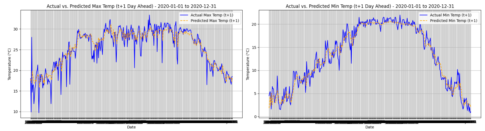
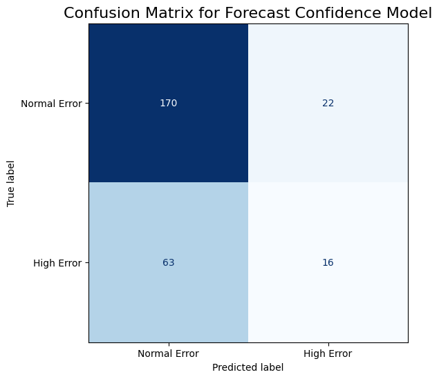
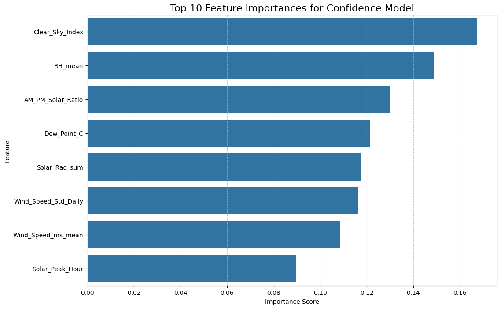

# Kathmandu Climate Insights: A Two-Part Forecasting System

**Project Status (July 2025):** Complete. This project has successfully developed and validated a two-part forecasting system, consisting of a high-performance temperature forecasting engine and an intelligent "Forecast Confidence" model.

This repository documents the end-to-end journey of building a sophisticated machine learning system to forecast daily temperatures in Kathmandu. The project's narrative is one of iterative development, deep-dive diagnostics, and strategic pivoting in response to complex, real-world data challenges. What began as a standard forecasting task evolved into a deep exploration of data non-stationarity, overfitting, and advanced feature engineering, culminating in a hybrid, two-model solution designed for real-world reliability.

---

### Table of Contents
1.  [The Problem Statement & Scope](#the-problem-statement--scope)
2.  [Final System Architecture](#final-system-architecture)
3.  [The Project Journey: A Four-Phase Investigation](#the-project-journey-a-four-phase-investigation)
    *   [Phase 1: Establishing the Champion Forecaster](#phase-1-establishing-the-champion-forecaster)
    *   [Phase 2: The Challenge of Incomplete Data](#phase-2-the-challenge-of-incomplete-data)
    *   [Phase 3: Diagnosing Failed Improvements](#phase-3-diagnosing-failed-improvements-with-new-data)
    *   [Phase 4: The Strategic Pivot to a "Confidence Model"](#phase-4-the-strategic-pivot-to-a-confidence-model)
4.  [Final Model Performance](#final-model-performance)
    *   [Forecasting Engine Performance](#forecasting-engine-performance)
    *   [Confidence Engine Performance](#confidence-engine-performance)
5.  [Application & Deployment Blueprint](#application--deployment-blueprint)
6.  [Future Work: Deep Learning](#future-work-deep-learning)
7.  [Technologies & Libraries](#technologies--libraries)
8.  [Acknowledgements](#acknowledgements)

---

### The Problem Statement & Scope

The primary objective was to develop a reliable system for forecasting daily maximum and minimum temperatures for Kathmandu, Nepal. An initial analysis of a 5-day forecast horizon revealed a significant drop in performance beyond 72 hours. To maximize practical value and reliability for operational use cases, the project scope was strategically refined to a **1- to 3-day operational forecast horizon.**


*Minimum and Maximum Temperature for Kathmandu from 1999-2024*

---

### Final System Architecture

The project concluded with a two-part system designed to provide both accurate forecasts and a crucial assessment of their reliability.

**System Workflow:**

> 1.  **Input:** The latest atmospheric data (RH, Wind, Solar, etc.) for the current day is provided to the system.
> 2.  **Parallel Processing:**
>     *   The **Forecasting Engine** (`Champion Model`) uses a feature set based on long-term history to generate the core temperature forecast.
>     *   The **Confidence Engine** (`Co-Pilot Model`) uses a feature set based on advanced physics and intra-day dynamics to assess the stability of the atmosphere.
> 3.  **Output Synthesis:** The system combines the outputs to provide a final, context-rich forecast to the user.
>     *   *Example Output:* `"T+1 Max Temp: 29°C (Confidence: HIGH)"` or `"T+1 Max Temp: 31°C (Confidence: LOW - conditions are unstable)"`

This hybrid approach leverages the unique strengths of two specialized models to deliver a more valuable and reliable product than a single model could achieve.

---

### The Project Journey: A Four-Phase Investigation

The final architecture was the result of a rigorous, multi-stage investigation where "failed" experiments provided the most critical insights.

#### Phase 1: Establishing the Champion Forecaster
The project began by focusing on the 25-year historical dataset (`df_analysis.csv`) to create the strongest possible baseline forecaster.

*   **Experiment - XGBoost vs. Random Forest:** A head-to-head competition was conducted. Both models were optimized using `RandomizedSearchCV` with a `TimeSeriesSplit` for robust, time-aware cross-validation.
*   **Outcome:** The XGBoost model proved definitively superior. This model was saved as **`champion_model_phase1.joblib`**.


*Actual vs. Predicted plot for the final Champion Model, showing its strong ability to capture seasonal trends.*

#### Phase 2: The Challenge of Incomplete Data
The project's trajectory was defined by the attempt to integrate new, high-resolution atmospheric data (Relative Humidity, Wind Speed/Direction, and Solar Radiation). A critical challenge emerged immediately: **the new, high-quality data was only available from late 2020 onwards**, while our core dataset stretched back to 1999. This "Data Gap" made a simple merge impossible and dictated the course of all future experiments.

#### Phase 3: Diagnosing Failed Improvements with New Data
The core of this project involved investigating why intuitive attempts to improve the Champion model were unsuccessful.

1.  **The `df_historical` Experiment (The Non-Stationarity Problem):**
    *   **Attempt:** To improve the Champion by integrating a 25-year Relative Humidity (RH) dataset.
    *   **Result:** The model's performance became significantly *worse* (t+1 Max Temp MAE worsened from 1.34°C to **1.64°C**).
    *   **Diagnosis:** This uncovered a critical **"Data Non-Stationarity"** issue. We concluded that the relationship between variables had changed over the 25-year period, making a single, unified model on this dataset unreliable.

2.  **The `Hybrid Physics Model` Experiment (The Overfitting Problem):**
    *   **Attempt:** To build a new, standalone forecaster on the recent, data-rich dataset (2020-2024), powered by sophisticated physics-informed features.
    *   **Result:** These models failed to beat the Champion, with the best attempt yielding a t+1 Max Temp MAE of **1.54°C**.
    *   **Diagnosis:** A classic case of **severe overfitting**. The models were too complex for the short 4-year time frame; they had deep physics knowledge but lacked the long-term "experience" of the Champion and were "memorizing" noise.

#### Phase 4: The Strategic Pivot to a "Confidence Model"
These critical findings led to the final, successful strategy. If the recent data couldn't improve the forecast's *accuracy*, perhaps it could predict its *reliability*. The project was repurposed to build a classifier to predict when the Champion's forecast is likely to have a high error. This required a deep dive into advanced feature engineering, including `Dew_Point`, `Intra-Day Solar Dynamics`, and `Dynamic Anomaly` features, as well as a careful, cross-validated tuning process to balance the Precision-Recall trade-off.

---

### Final Model Performance

This two-track strategy yielded two successful, specialized models.

#### Forecasting Engine (`Champion Model`) Performance
This model remains the most accurate direct forecaster, outperforming all other experimental regression models.

**Full Performance Metrics Table (t+1 Horizon, MAE):**
| Model | Max Temp MAE | Min Temp MAE | Notes |
| :--- | :---: | :---: | :--- |
| Linear Regression | 1.35°C | 0.96°C | The initial baseline. |
| Tuned Random Forest | 1.40°C | 0.96°C | Outperformed by XGBoost. |
| XGBoost on `df_historical` | 1.64°C | 1.39°C | Degraded performance due to non-stationarity. |
| Physics-Aware Model (`df_recent`) | 1.54°C | 0.92°C | Strong `Min Temp` but poor `Max Temp` due to overfitting. |
| **XGBoost Champion (Final)** | **1.34°C** | **0.94°C** | **The winning forecaster.** |

#### Confidence Engine (`Final Tuned Classifier`) Performance
The final classifier was optimized for a balance between precision and recall, resulting in a system that provides a reliable warning for potentially inaccurate forecasts.

|  |  |
| :---: | :---: |
| *Confusion Matrix for the Final Confidence Model* | *Top Features Driving Forecast Unpredictability* |

**Final Classification Report:**
| Class | Precision | Recall | F1-Score | Accuracy
| :--- | :---: | :---: | :---: | :---: |
| Normal Day | 0.71 | 0.98 | 0.80 |   |
| **High-Error Day**| **0.43** | **0.20** | 0.27 | 0.69 |

**Conclusion:** The Confidence Model was tuned to be highly "cautious" and reliable. While it identifies a smaller subset of high-error days (20% recall), the warnings it provides are somewhat precise (**43% precision**). This means that when the model *does* raise a red flag, it is a very trustworthy signal of atmospheric instability, providing a significant "edge" over the 25% baseline chance.

---

### Application & Deployment Blueprint

This two-part system is designed to be deployed as a simple API that could power an interactive web application or be used for research.

#### Backend (Python with Flask/FastAPI)
1.  **API Endpoint:** A single endpoint `POST /predict` would accept a JSON object with the latest day's weather data.
2.  **Model Loading:** On startup, the server would load both `champion_model_phase1.joblib` and the final `confidence_model.joblib` into memory.
3.  **Feature Engineering:** A dedicated module would take the input JSON and perform all the necessary feature engineering steps to prepare the data for both models.
4.  **Prediction Logic:**
    *   The feature vector for the Champion is passed to the **Forecasting Engine** to get the 3-day temperature predictions.
    *   The feature vector for the Co-Pilot is passed to the **Confidence Engine** to get the `t+1` confidence score.
5.  **API Response:** The endpoint returns a clean JSON object:
    ```json
    {
      "forecast_t+1": {
        "max_temp_c": 29.5,
        "min_temp_c": 18.2,
        "confidence": "HIGH" // or "LOW"
      },
      "forecast_t+2": { ... },
      "forecast_t+3": { ... }
    }
    ```

---

### Future Work: Deep Learning
The next phase of this project will explore if **LSTMs (Long Short-Term Memory networks)**, using the rich physics-informed features from the recent data, can build a more sensitive "Confidence Engine" (improving recall) or challenge the Champion forecaster directly.

---

### Technologies & Libraries
*   **Languages:** Python
*   **Libraries:** Pandas, NumPy, Scikit-learn, XGBoost, Matplotlib, Seaborn, Joblib

---

### Acknowledgements
The historical climate data used in this project was provided by the Department of Hydrology and Meteorology (DHM), Government of Nepal. A huge shoutout to GD Labs and Research for helping acquire the data. 